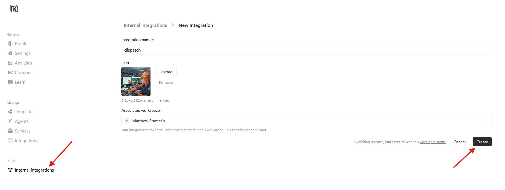

My personal task runner controlled by my phone. `dispatch` allows me to have a feedback loop for my research and a Command & Control Center for my Agentic Pipeline.


## Architecture

- [Notion](https://www.notion.so) as a datasource
- [RabbitMQ](https://www.rabbitmq.com/) for dispatching changes

## Setup

### Notion

{NOTION:TODO:What needs to be created first} {See below}

#### Notion API Integration

Guide: <https://developers.notion.com/guides/get-started/create-a-notion-integration>

Create Integration: <https://www.notion.so/profile/integrations/internal/form/new-integration>


#### Page Response

```json
{
 "object": "page",
 "id": "31c70f9e-2042-8134-ba0d-f7a85bc8d9ef",
 "created_time": "2026-03-07T05:22:00.000Z",
 "last_edited_time": "2026-03-07T05:22:00.000Z",
 "created_by": {
  "object": "user",
  "id": "31ad872b-594c-81a0-9200-000247e8199b"
 },
 "last_edited_by": {
  "object": "user",
  "id": "31ad872b-594c-81a0-9200-000247e8199b"
 },
 "cover": null,
 "icon": null,
 "parent": {
  "type": "database_id",
  "database_id": "<GUID>"
 },
 "in_trash": false,
 "is_locked": false,
 "properties": {
  "Upvoted by": {
   "id": "%3DWqp",
   "type": "people",
   "people": []
  },
  "Total votes": {
   "id": "Ct%5D_",
   "type": "formula",
   "formula": {
    "type": "number",
    "number": 0
   }
  },
  "URL": {
   "id": "LE%3Ai",
   "type": "url",
   "url": "https://docs.openwebui.com/features/extensibility/open-terminal/"
  },
  "Category": {
   "id": "VcWA",
   "type": "multi_select",
   "multi_select": []
  },
  "Created by": {
   "id": "WtrU",
   "type": "created_by",
   "created_by": {
    "object": "user",
    "id": "31ad872b-594c-81a0-9200-000247e8199b"
   }
  },
  "Priority": {
   "id": "%5Dr%5DK",
   "type": "select",
   "select": null
  },
  "Upvote": {
   "id": "tdfz",
   "type": "button",
   "button": {}
  },
  "Date": {
   "id": "%7C_%7B%5C",
   "type": "date",
   "date": null
  },
  "Idea": {
   "id": "title",
   "type": "title",
   "title": [
    {
     "type": "text",
     "text": {
      "content": "Open Terminal",
      "link": null
     },
     "annotations": {
      "bold": false,
      "italic": false,
      "strikethrough": false,
      "underline": false,
      "code": false,
      "color": "default"
     },
     "plain_text": "Open Terminal",
     "href": null
    }
   ]
  }
 },
 "url": "https://www.notion.so/Open-Terminal-31c70f9e20428134ba0df7a85bc8d9ef",
 "public_url": null,
 "archived": false
}
```

## Gmail Setup

Create a new gmail for notifications. Once the login is created, enable 2FA. This is mandatory, so you'll be able to create an App Password.

### App Password

Create an [app password](https://myaccount.google.com/apppasswords)

### RabbitMQ


## Usage

Commands can be added to the {NOTION:TODO:What needs to be created first} and those commands will send a message to RabbitMQ. These are the commands that are supported and what they do.

- Build:
- Code Review:
- Learn:
- Research:
- Blog:
- Specs:
- Tasks:
- Follow Up:
